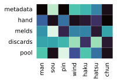
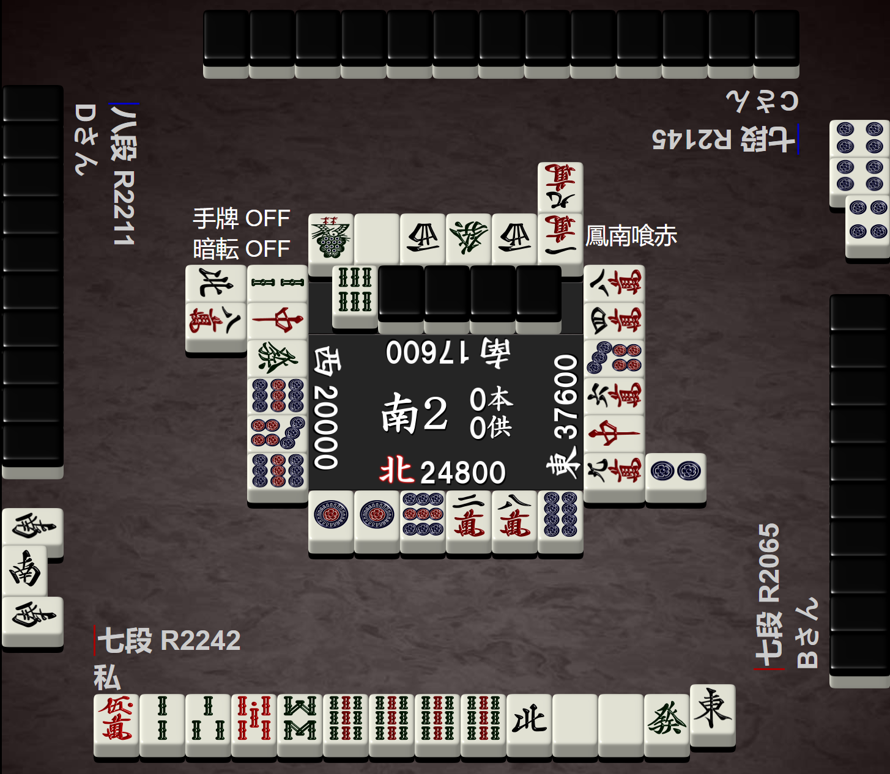
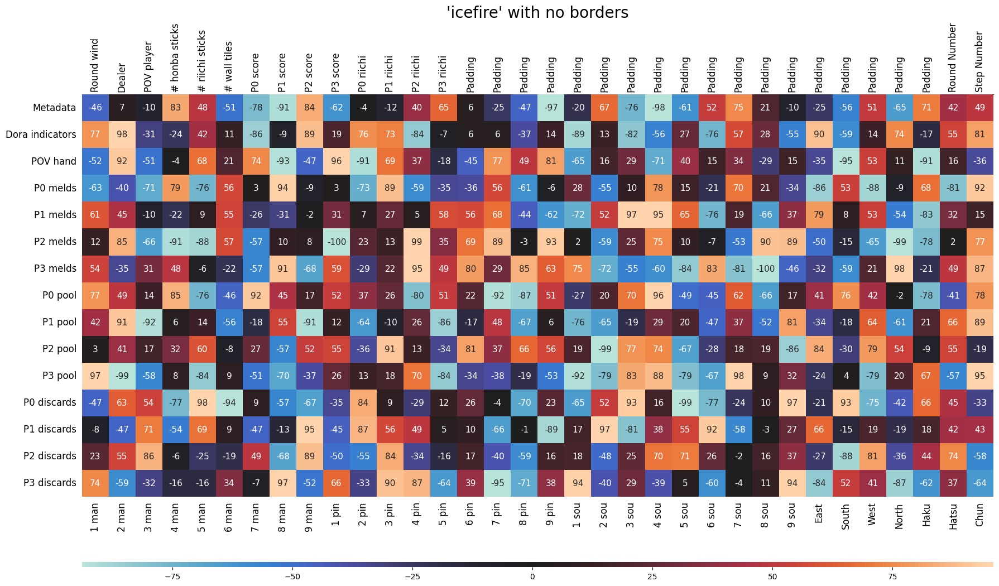
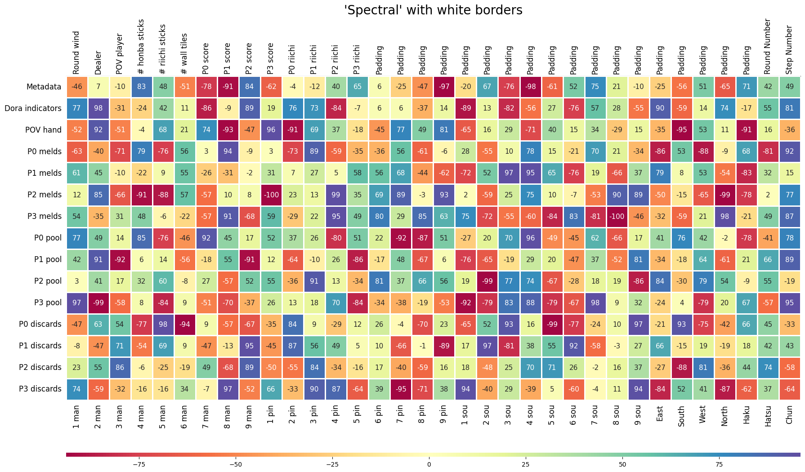
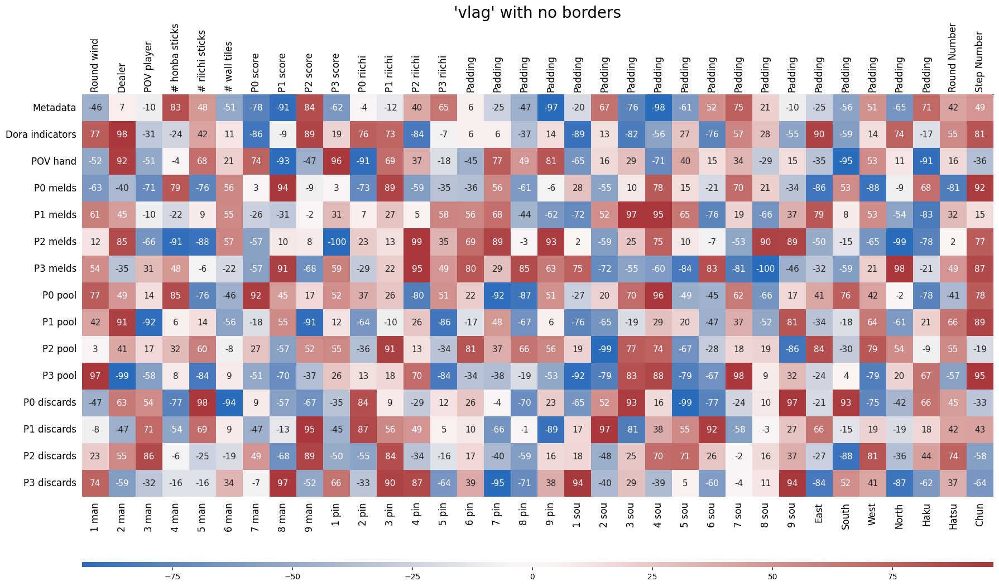

<p align="center">
    
</p>


<h2 align="center">Mahjong Heatmap</h2>

<p align="center">
<a href="./LICENSE"></a>
<a href="https://github.com/psf/black"></a>
<a href="https://en.wikipedia.org/wiki/Cat"></a>
</p>

<p align="center">
<i>"Visualize your Mahjong boards as heatmaps! 🀄"</i>
</p>


## Preface

The code you are currently reading was originally designed for visualizing [Japanese Mahjong board states](https://www.kaggle.com/datasets/trongdt/japanese-mahjong-board-states), and is used in my thesis: 

> ["A Supervised Attention-Based Multiclass Classifier for Tile Discarding in Japanese Mahjong"](https://hdl.handle.net/11250/2823898)

The code has since been improved for future use. 

If you choose to use it in your works, be it academic or personal work, it would mean a lot to me if you credited my code in your works.

## How to use

1. Copy `mahjong_heatmap.py` into your project.
2. Install necessary Python libraries (see [requirements.txt](./requirements.txt)).
    ```bash
    pip install -r requirements.txt
    ```
3. Import file into your code, see [Jupyter Notebook](./example_usage.ipynb) for example usages.


## Examples

See [`resources`](./resources/) and the [Jupyter Notebook](./example_usage.ipynb) for more examples.

### Visualizing Mahjong board state

Useful for presenting a board state matrix:

Tenhou Board             |  Heatmap
:-------------------------:|:-------------------------:
  |  


### Colorful Heatmaps

You can create colorful heatmaps to spice up your works:

<p align="center">
    
</p>

<p align="center">
    
</p>

<p align="center">
    
</p>